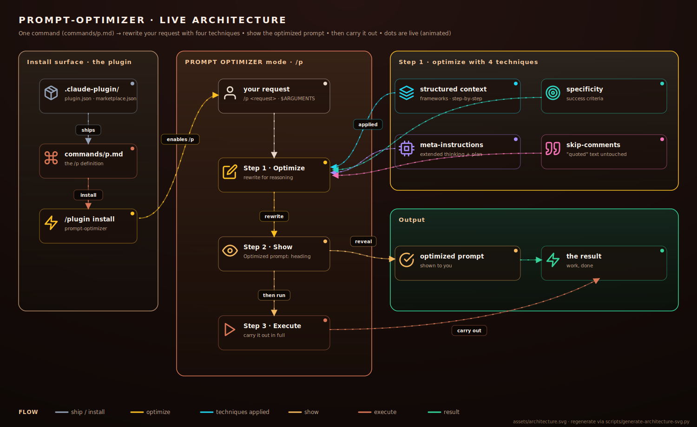

# Architecture

claude-prompt is about as simple as a Claude Code plugin gets: one slash command,
two manifests, and the packaging/CI around them. There is no runtime code.

<div align="center">



</div>

## The two surfaces

**Install surface.** The marketplace reads `.claude-plugin/marketplace.json`, which
points at this repo as a plugin. `.claude-plugin/plugin.json` is the manifest, and
`commands/p.md` is the command body. Installing the plugin makes `/claude-prompt:p`
available in the session — Claude Code namespaces every plugin command, so the bare `/p`
is reserved for personal/project commands (see the README's *Shorten to `/p`*).

**The `/claude-prompt:p` run.** When you type `/claude-prompt:p <request>`, Claude Code substitutes your text for
`$ARGUMENTS` in `commands/p.md` and runs the resulting prompt. That prompt puts Claude
into "PROMPT OPTIMIZER" mode:

0. **Read** — classify the request silently: the `--dry` flag (optimize-only), the **type**
   (task · question · improve-this), **clarity**, and **stakes**. Then a gate: ambiguous →
   ask 1–3 questions; high-stakes/mutating → state the blast radius and confirm; otherwise
   continue with no round-trip. A data/instruction fence keeps the request's text from
   overriding these steps.
1. **Optimize** — rewrite the request into a sharper prompt using four techniques:
   - **Structured context** — explicit reasoning frameworks and step-by-step structure.
   - **Specificity** — vague asks become detailed requirements with success criteria.
   - **Meta-instructions** — guidance that leverages extended thinking and planning.
   - **Skip-comments** — reproduce literals verbatim: quotes, inline/fenced code, file
     paths, URLs, regexes, and error strings. Right-sized so a small ask stays small.
2. **Show** — print the rewrite under an `**Optimized prompt:**` heading. For `--dry` or an
   improve-this request, this block is the deliverable and the run stops here.
3. **Execute** — carry out the optimized prompt in full (a task gets done, a question answered).

That's the entire system. The diagram above is the live version (animated in the SVG).

## Why no code?

Keeping the plugin to a single command file means there is nothing to audit beyond the
prompt itself, nothing to run on your machine, and no dependency surface. The
[security model](../SECURITY.md) leans entirely on that simplicity.

## Regenerating the diagram

`assets/architecture.svg` is generated, not hand-written:

```bash
python3 scripts/generate-architecture-svg.py
```

The brand primitives (palette, node cards, animated flows, the dark/light CSS) live in
`scripts/svgkit.py`. If you change the command flow, edit the generator and rerun it,
then commit the regenerated SVG.
